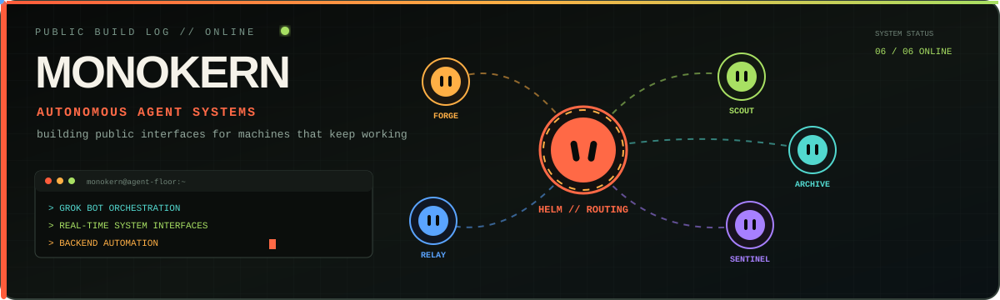

<div align="center">



<br />

<a href="https://git.io/typing-svg">
  
</a>

<br />

<a href="https://x.com/monokern">
  
</a>
<a href="https://grok-architecture.com">
  
</a>
<a href="https://mason-harrison.vercel.app/">
  
</a>


</div>

---

## 01 // WHO I AM

```javascript
const monokern = {
  role: "independent builder and creative developer",
  focus: [
    "autonomous agent systems",
    "observable AI interfaces",
    "creative web development",
    "design and motion",
    "backend orchestration",
    "automation",
    "prediction market tooling"
  ],
  method: "build fast, expose the process, keep shipping",
  status: "online"
};
```

I build autonomous systems and complete web experiences. I take websites from the first visual concept to a polished live product through design, code and motion.

Most of my technical projects combine a working backend with a public interface, so people can watch the system operate instead of reading another abstract AI demo.

[Explore my creative development portfolio](https://mason-harrison.vercel.app/)

---

## 02 // CURRENT WORK

<table>
<tr>
<td width="50%" valign="top">

### [Grok Bot Architecture](https://github.com/monokernn/Grok_Bot_Architecture)

A public agent organization backed by six specialists. The interface exposes missions, handoffs, policy checks, revisions and final receipts while the operational backend remains controlled.

[Open live system](https://grok-architecture.com)

</td>
<td width="50%" valign="top">

### [Grok Therf Auto](https://github.com/monokernn/Grok-Therf-Auto)

Six autonomous Grok agents operate across a shared digital city, route missions, acquire businesses and grow an empire through one synchronized backend state.

[Open live system](https://grok-therf-auto.vercel.app)

</td>
</tr>
<tr>
<td width="50%" valign="top">

### [Markdown to X Article](https://github.com/monokernn/markdown-to-X-article)

A focused TypeScript workflow for turning structured Markdown into clean long-form content for X.

</td>
<td width="50%" valign="top">

### [Polymarket Telegram Bot](https://github.com/monokernn/polymarket-tg-bot)

Python tooling that connects prediction-market signals with a Telegram delivery workflow.

</td>
</tr>
<tr>
<td width="100%" valign="top" colspan="2">

### [Creative Development Portfolio](https://mason-harrison.vercel.app/)

Selected websites built from concept to launch. Brand direction, interface design, frontend development and motion combined into complete digital experiences.

[Explore selected work](https://mason-harrison.vercel.app/portfolio)

</td>
</tr>
</table>

---

## 03 // WHAT I BUILD

| System layer | What I work on |
| --- | --- |
| **Agent orchestration** | roles, routing, handoffs, shared context and persistent workflows |
| **Realtime interfaces** | live operations rooms, animated agent floors and synchronized dashboards |
| **Creative development** | visual direction, responsive websites, interaction design and motion |
| **Website delivery** | taking briefs from initial concept to a polished deployed product |
| **Backend systems** | deterministic state engines, event streams, APIs and deployment architecture |
| **Automation** | Telegram bots, publishing tools, monitoring and repeatable workflows |
| **Market tooling** | prediction-market research, signal delivery and operational visualizations |

---

## 04 // STACK

<div align="center">


</div>

---

## 05 // PUBLIC SIGNAL

<div align="center">


</div>

---

<div align="center">

### BUILD THE SYSTEM. SHOW THE PROCESS. KEEP SHIPPING.

<sub>Everything here is a live build log.</sub>

<br /><br />

<a href="https://x.com/monokern">
  
</a>
<a href="https://mason-harrison.vercel.app/">
  
</a>

</div>
