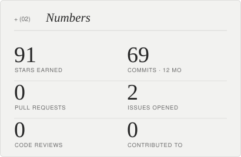
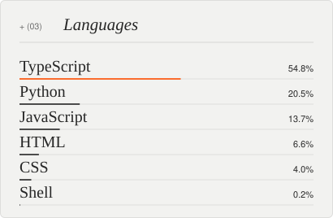
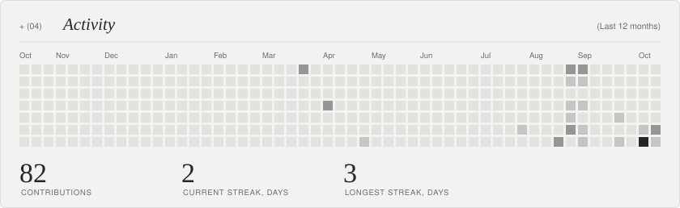
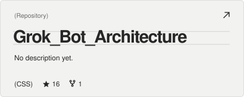
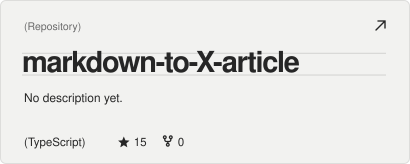
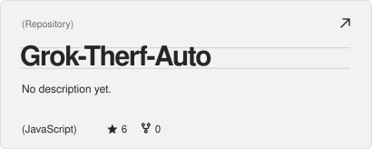
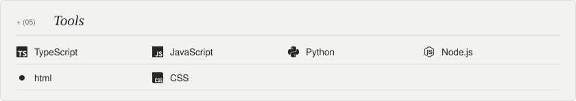

<!-- readme-atelier:start -->
<!-- Generated by Readme Atelier (https://github.com/monokernn/readme-atelier). Edit atelier.yml instead of this block. -->

<picture><source media="(prefers-color-scheme: dark)" srcset="./atelier/header-dark.f25ff699.svg"/></picture>

  <a href="https://x.com/monokern"><picture><source media="(prefers-color-scheme: dark)" srcset="./atelier/social-x-dark.80c682ed.svg"/></picture></a>&nbsp;
  <a href="https://github.com/monokernn"><picture><source media="(prefers-color-scheme: dark)" srcset="./atelier/social-github-dark.ef8bd18a.svg"/></picture></a>&nbsp;
  <a href="https://monokern.design"><picture><source media="(prefers-color-scheme: dark)" srcset="./atelier/social-website-dark.3feee6e3.svg"/></picture></a>

  <picture><source media="(prefers-color-scheme: dark)" srcset="./atelier/stats-dark.7d02a4d1.svg"/></picture>
  <picture><source media="(prefers-color-scheme: dark)" srcset="./atelier/languages-dark.4eae8ecc.svg"/></picture>

<picture><source media="(prefers-color-scheme: dark)" srcset="./atelier/activity-dark.e14aa584.svg"/></picture>

  <a href="https://github.com/monokernn/readme-atelier"><picture><source media="(prefers-color-scheme: dark)" srcset="./atelier/repo-1-dark.30168de1.svg"/></picture></a>
  <a href="https://github.com/monokernn/Grok&#95;Bot&#95;Architecture"><picture><source media="(prefers-color-scheme: dark)" srcset="./atelier/repo-2-dark.7ed99399.svg"/></picture></a>
  <a href="https://github.com/monokernn/markdown-to-X-article"><picture><source media="(prefers-color-scheme: dark)" srcset="./atelier/repo-3-dark.e2bbe9bc.svg"/></picture></a>
  <a href="https://github.com/monokernn/Grok-Therf-Auto"><picture><source media="(prefers-color-scheme: dark)" srcset="./atelier/repo-4-dark.45b90ba8.svg"/></picture></a>

<picture><source media="(prefers-color-scheme: dark)" srcset="./atelier/stack-dark.7f78bc34.svg"/></picture>

<picture><source media="(prefers-color-scheme: dark)" srcset="./atelier/footer-dark.a81fdbf3.svg"/></picture>

<!-- readme-atelier:end -->
