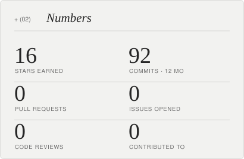
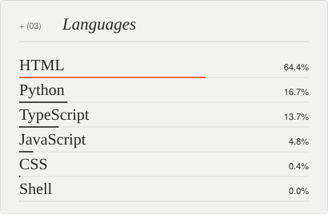
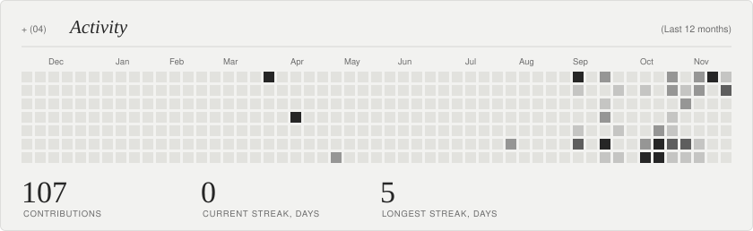
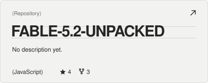
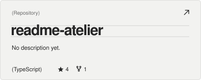
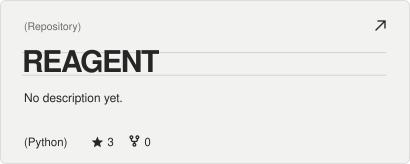
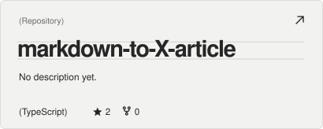

<!-- readme-atelier:start -->
<!-- Generated by Readme Atelier (https://github.com/monokernn/readme-atelier). Edit atelier.yml instead of this block. -->

<picture><source media="(prefers-color-scheme: dark)" srcset="./atelier/header-dark.2df41ff4.svg"/></picture>

  <a href="https://x.com/monokern"><picture><source media="(prefers-color-scheme: dark)" srcset="./atelier/social-x-dark.80c682ed.svg"/></picture></a>&nbsp;
  <a href="https://github.com/monokernn"><picture><source media="(prefers-color-scheme: dark)" srcset="./atelier/social-github-dark.ef8bd18a.svg"/></picture></a>&nbsp;
  <a href="https://monokern.design"><picture><source media="(prefers-color-scheme: dark)" srcset="./atelier/social-website-dark.3feee6e3.svg"/></picture></a>

  <picture><source media="(prefers-color-scheme: dark)" srcset="./atelier/stats-dark.03dc83e8.svg"/></picture>
  <picture><source media="(prefers-color-scheme: dark)" srcset="./atelier/languages-dark.3db08c82.svg"/></picture>

<picture><source media="(prefers-color-scheme: dark)" srcset="./atelier/activity-dark.f0b5b45a.svg"/></picture>

  <a href="https://github.com/monokernn/FABLE-5.2-UNPACKED"><picture><source media="(prefers-color-scheme: dark)" srcset="./atelier/repo-1-dark.e65abfba.svg"/></picture></a>
  <a href="https://github.com/monokernn/readme-atelier"><picture><source media="(prefers-color-scheme: dark)" srcset="./atelier/repo-2-dark.c7257bb0.svg"/></picture></a>
  <a href="https://github.com/monokernn/REAGENT"><picture><source media="(prefers-color-scheme: dark)" srcset="./atelier/repo-3-dark.d546b5bc.svg"/></picture></a>
  <a href="https://github.com/monokernn/markdown-to-X-article"><picture><source media="(prefers-color-scheme: dark)" srcset="./atelier/repo-4-dark.53421d34.svg"/></picture></a>

<picture><source media="(prefers-color-scheme: dark)" srcset="./atelier/stack-dark.7f78bc34.svg"/></picture>

<picture><source media="(prefers-color-scheme: dark)" srcset="./atelier/footer-dark.df63cdb8.svg"/></picture>

<!-- readme-atelier:end -->
